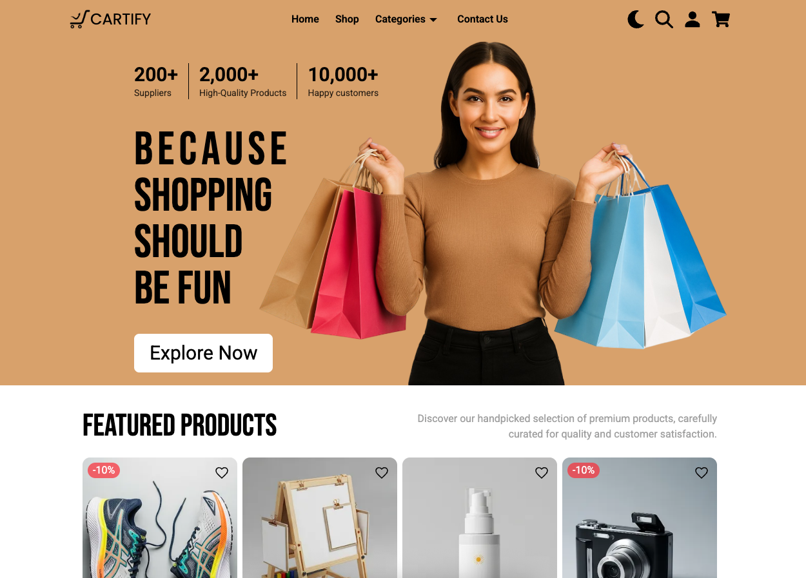
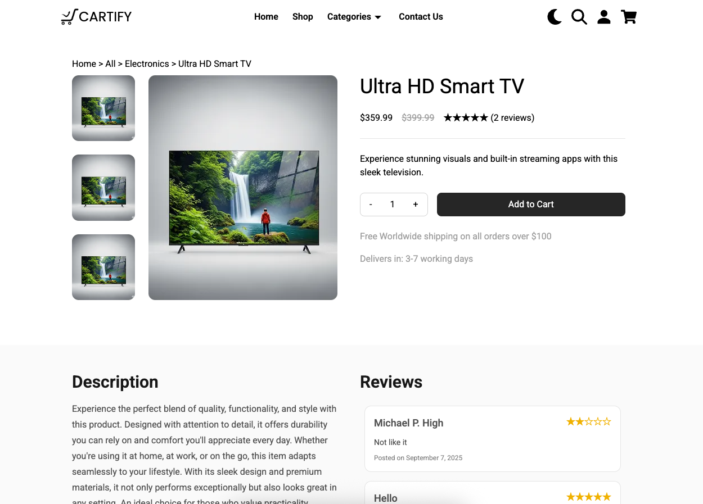

# Cartify — Modern E‑commerce Frontend


A modern, responsive e‑commerce frontend showcasing professional React development patterns, smooth animations, and optimized user experience. Built to demonstrate frontend engineering skills for technical interviews and resume portfolios.

> **Key Frontend Highlights**
>
> - 🚀 **Performance**: Code-splitting, lazy loading, optimized bundling with Vite
> - 🎨 **UX**: Smooth page transitions, dark/light themes, micro-interactions
> - ♿ **Accessibility**: Keyboard navigation, reduced-motion support, semantic HTML
> - 📱 **Responsive**: Mobile-first design with drawer nav and desktop mega menu
> - 🔧 **Architecture**: TypeScript, Context state, protected routes, clean API layer

## Demo

- **Live Site**: [Here](https://cartify-neon.vercel.app/)
- **Video Walkthrough**: [Add demo video link here]

### Screenshots

<table>
  <tr>
    <td width="50%">
      
      <p align="center"><em>Home page with hero</em></p>
    </td>
    <td width="50%">
      
      <p align="center"><em>Product details with reviews</em></p>
    </td>
  </tr>
</table>

## Quick Start

```bash
# Clone and setup
git clone https://github.com/TudorGR/Cartify.git
cd Cartify

# Start frontend (runs on http://localhost:5173)
cd client
npm install
npm run dev

# Optional: Start API in another terminal (runs on http://localhost:3000)
cd ../server
npm install
cp .env.example .env  # Add your MongoDB URI
npm run dev
```

**Environment Setup**: Create `client/.env` with:

```
VITE_API_URL=http://localhost:3000
```

## Frontend Architecture

### Core Technologies

- **React 19** + **TypeScript** + **Vite 7** — Modern development experience
- **Tailwind CSS 4** — Utility-first styling with design system consistency
- **React Router 7** — Client-side routing with lazy-loaded pages
- **Framer Motion 12** — Smooth page transitions and micro-interactions

### Key Features

**🎭 Animated UX**

- Direction-aware page transitions with `NavigationContext`
- Respects `prefers-reduced-motion` for accessibility
- Cart badge animations and loading skeletons

**🔍 Smart Search**

- Debounced search with keyboard navigation (↑↓ arrows, Enter, Esc)
- Real-time results with skeleton loading states
- Mobile-responsive overlay design

**🛒 State Management**

- React Context for user, theme, cart, and favourites
- Cart persisted to localStorage as `Map<string, CartItem>`
- Protected routes with authentication guards

**🖼️ Performance Optimizations**

- Custom `LazyImage` component with IntersectionObserver
- Route-based code splitting with React.lazy + Suspense
- Manual Vite chunking for vendor/router/ui bundles
- Optimized bundle size with tree-shaking

### Notable Components

| Component              | Purpose                                        |
| ---------------------- | ---------------------------------------------- |
| `PageAnimationWrapper` | Handles route transitions with motion variants |
| `LazyImage`            | Intersection Observer + native lazy loading    |
| `Navbar`               | Mega menu, mobile drawer, search, theme toggle |
| `ProtectedRoute`       | Authentication-based route guarding            |
| `userContext`          | Global state for user/theme/cart/favourites    |

## Project Structure

```
Cartify/
├── client/                 # React + TypeScript frontend
│   ├── src/
│   │   ├── pages/         # Route components (lazy-loaded)
│   │   ├── pages/components/  # UI building blocks
│   │   ├── context/       # React Context providers
│   │   ├── api.ts         # Axios config + interceptors
│   │   └── main.tsx       # App entry point
│   ├── vite.config.ts     # Build optimization
│   └── package.json       # Frontend dependencies
└── server/                # Express API (optional for demo)
    ├── routes/            # API endpoints
    ├── models/            # MongoDB schemas
    └── index.js           # Server entry point
```

## Pages & User Flows

**Core E-commerce Experience**

- **Home** → Featured products, categories, testimonials
- **Shop** → Product listings with filters and search
- **Product Details** → Images, specs, reviews, add to cart
- **Cart & Checkout** → Order summary, payment form
- **Auth Flow** → Login/signup with Google OAuth option

**Additional Pages**

- User profile (protected route)
- Contact form with validation
- Legal pages (Terms, Privacy)

All routes include:

- ✅ Lazy loading for performance
- ✅ Animated transitions
- ✅ Dark/light theme support
- ✅ Mobile-responsive design

## Development Highlights

1. **Performance Engineering** — Implemented code-splitting, lazy images, and optimized bundling
2. **Accessible Motion** — Framer Motion with reduced-motion compliance
3. **State Architecture** — Context API with localStorage persistence and TypeScript safety
4. **UX Polish** — Debounced search, keyboard navigation, micro-interactions
5. **Modern Tooling** — Vite for fast dev/build, ESLint + TypeScript for code quality

## Tech Stack

**Frontend Core**

- React 19, TypeScript, Vite 7
- Tailwind CSS 4, Framer Motion 12
- React Router 7, React Context API

**UI & UX Libraries**

- react-hot-toast (notifications)
- react-icons (icon system)
- react-loading-skeleton (loading states)
- react-useanimations (micro-interactions)

**Backend (for local development)**

- Node.js 20, Express 5
- MongoDB with Mongoose
- Passport.js (Google OAuth)

## Deployment

**Frontend**: Optimized for Vercel, Netlify, or any static host

```bash
cd client && npm run build
# Deploy the dist/ folder
```

**Full-stack**: Both client and server are Vercel-ready with included `vercel.json` configs

## Environment Variables

**Client** (`client/.env`)

```
VITE_API_URL=your-api-base-url
```

**Server** (`server/.env`)

```
MONGODB_URI=your-mongodb-connection
CLIENT_URL=your-frontend-url
GOOGLE_CLIENT_ID=oauth-client-id (optional)
GOOGLE_CLIENT_SECRET=oauth-secret (optional)
```

_Built with ❤️ to showcase modern React development patterns_
